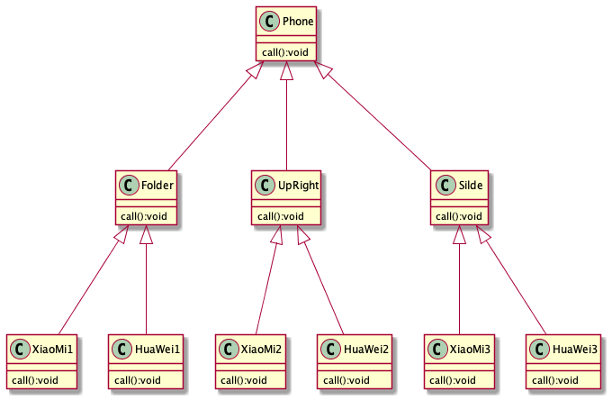

## 桥接模式
### 手机操作问题
不同类型不同品牌的手机实现操作
#### 传统方法

* 传统方法问题分析
    * 扩展性问题（类爆炸），新增手机类型、品牌是类会倍数增长
    * 违反单一职责，增加手机样式时候，同时需要增加所有手机品牌
### 解决方案-桥接模式
* 将实现和抽象放到不同的类层次中，使两个层次可以独立改变
* 属于结构型设计模式
### 注意点+细节
* 抽象和实现分离，提高系统灵活性
* 桥接替代多层继承方案，减少子类个数，降低系统管理和维护成本
* 桥接模式要求正确识别系统中两个独立变化的维度（抽象、实现），使用范围有一定的局限性
### 场景使用场景
* JDBC驱动程序
* 银行转账
    * 分类：网上转账、柜台转账、AMT转账
    * 用户：普通用户、银卡用户、金卡用户
* 消息管理
    * 类型：即时消息、延时消息
    * 分类：手机短信、邮件消息、QQ消息